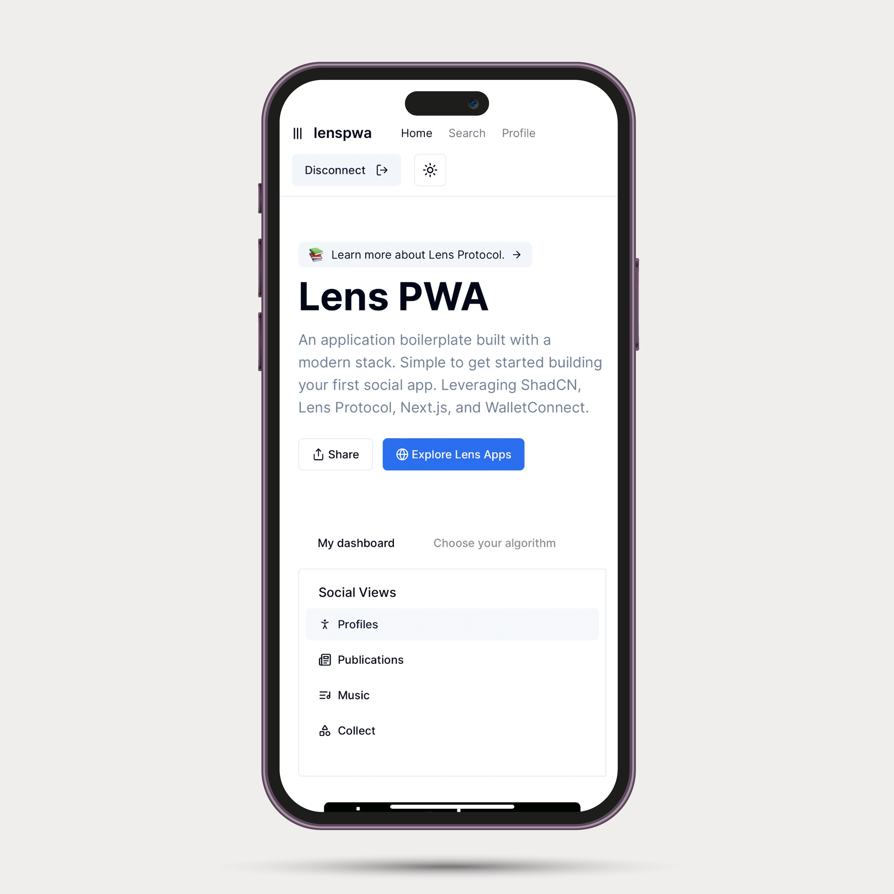

## PWA Lens Protocol example app

A boilerplate combining [Lens Protocol](https://www.lens.xyz/), [WalletConnect](https://walletconnect.com/), [Privy](https://www.privy.io/), and [ShadCN UI](https://ui.shadcn.com/)



## Getting started

1. Clone repo

```sh
git clone git@github.com:dabit3/lens-shadcn.git
```

2. Install dependencies

```sh
npm install # or yarn, etc..
```

3. Configure environment variables for WalletConnect & Privy

```sh
# rename .example.env.local to .env.local 
NEXT_PUBLIC_WC_ID=
NEXT_PUBLIC_PRIVY_APP_ID=
```

4. Run the app

```sh
npm run dev
```